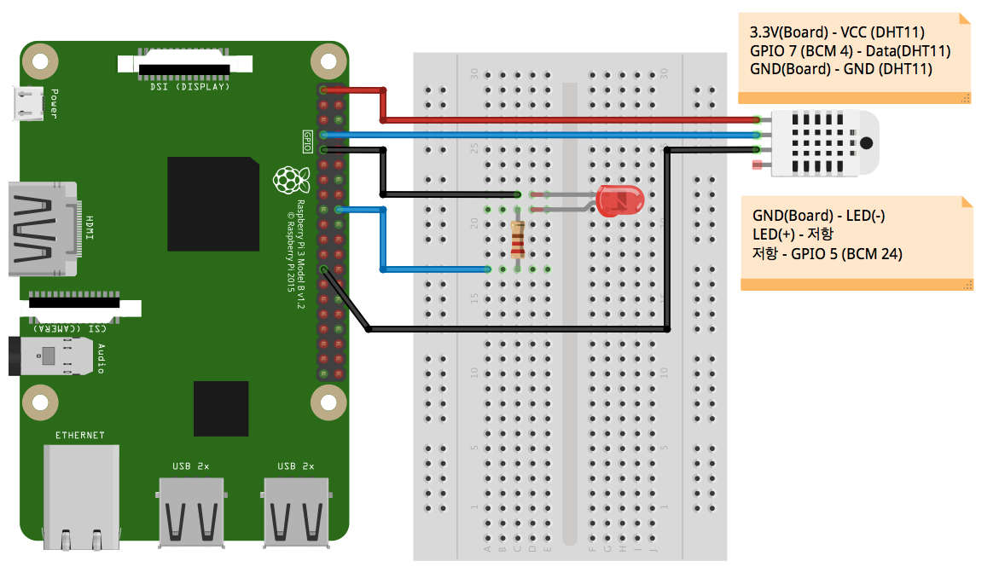

# raspberry-java-led

## 하드웨어 구성도

1. LED 제어 배선
	- 라즈베리파이 **GND**(보드 9번핀)을 **LED 음극**(캐소드, 짧은 단자)에 연결
	- **LED 양극**(애노드, 긴 단자)을 **저항 (330~1K 옴)**에 연결
	- 저항의 나머지 한 끝을 라즈베리파이 **GPIO5 (BCM 24, 보드 18번핀)** 연결

